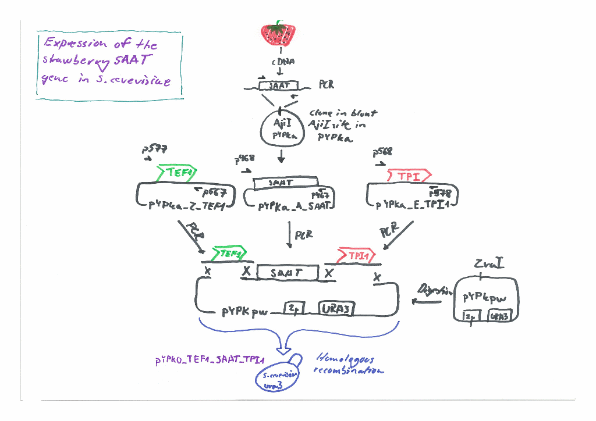

# pydna-examples

This repository contains Jupyter notebooks and data files 
that demonstrate how [pydna](https://github.com/BjornFJohansson/pydna/blob/py3dev/README.md) 
can be used to plan, document and simulate cloning experiments.

Static versions of the notebooks can be displayed as web pages through [nbviewer](http://nbviewer.jupyter.org/github/BjornFJohansson/pydna-examples/blob/master/index.ipynb).

Example of a notebook located in a [dropbox folder](http://nbviewer.ipython.org/urls/dl.dropboxusercontent.com/u/1263722/served_from_dropbox.ipynb
). A notebook in a public dropbox folder is not indexed by search engines such as Google. 

Click on the "launch binder" image below to run the notebooks on the cloud service [Mybinder](http://mybinder.org/).
This way notebooks can be executed online without having to install anything on the users computer.

 N.B. Mybinder runs on infrastructure paid for by the [Freeman lab](https://www.janelia.org/our-research/former-labs/freeman-lab).
Please do not abuse the service. If you want to do extensive testing of these notebooks, it is better to download this repository 
and run the notebooks locally (the notebooks will also run faster).

The contents of this repository is released under the MIT [Licence](License.md)

Use this Digital Object Identifier (DOI) when citing this repository.

