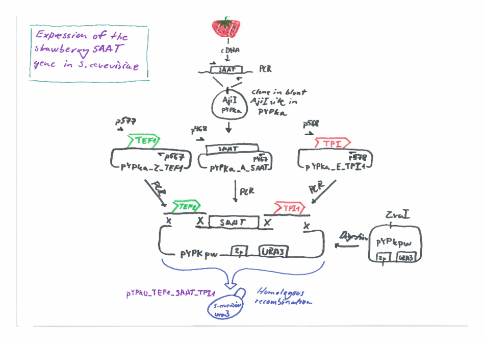

# pydna-examples
This repository contains Jupyter notebooks demonstrate how [pydna](https://github.com/BjornFJohansson/pydna/blob/py3dev/README.md) 
can be used to plan, document and simulate virtually any cloning experiment.

 
The links below open a static version of each notebook as a web page directly on Github.

* Construction of the [YEp24PGK_XK](simple_examples/YEP24_PGK_XK.ipynb) vector using restriction and ligation.

* Construction of the [pGUP1](simple_examples/pGUP1.ipynb) sequence using _in-vivo_ homologous recombination

* Assembly of the 32 [Mumberg expression vectors](mumberg_32_expression_vectors/mumberg_32_vectors.ipynb)

* Assembly of the [pGreenLantern-1](pGreenLantern1/pGreenLantern1.ipynb) sequence.

* Expression of the [Strawberry aat gene](strawberry_aat/strawberry.ipynb) in _Saccharomyces cerevisiae_ using the Yeast Pathway Kit

* [Gibson](gibson/gibson.ipynb) assembly example 

* Golden gate cloning [example](golden_gate/golden_gate1.ipynb)

Static versions of the notebooks can also be displayed as 
web pages through [nbviewer](http://nbviewer.jupyter.org/github/BjornFJohansson/pydna-examples/blob/master/index.ipynb).

## Misc examples

* [Primer screening with pydna](http://nbviewer.jupyter.org/github/BjornFJohansson/pydna-examples2/blob/master/primer_screen.ipynb)

## Dynamic notebooks

Click on the red and black "launch binder" image above to run the notebooks on the cloud service [mybinder](http://mybinder.org/).
This way notebooks can be executed dynamically online without need to install anything on the users computer.

N.B. Mybinder runs on infrastructure paid for by the [Freeman lab](https://www.janelia.org/our-research/former-labs/freeman-lab).
Please do not abuse the service. If you want to do extensive testing of these notebooks, please download this repository 
and run the notebooks locally (the notebooks will also run faster).

## Automatic testing

The Jupyter notebooks in this repository are tested using a continuous integration service. 
A fresh install of all depending software is performed once per month or whenever the files in this repository change.
The tests compare the old, saved output from each code cell with a newly calculated output. 
If the content do not match for any cell, the badge above turns red. 
The bagde is also a link to the server where the tests are performed.

The contents of this repository is released under the MIT [Licence](Licence.md)

## Citation

Use this Digital Object Identifier (DOI) when citing this repository.

